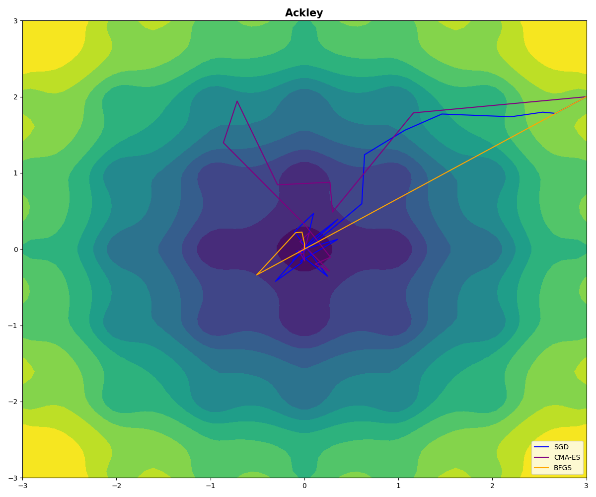
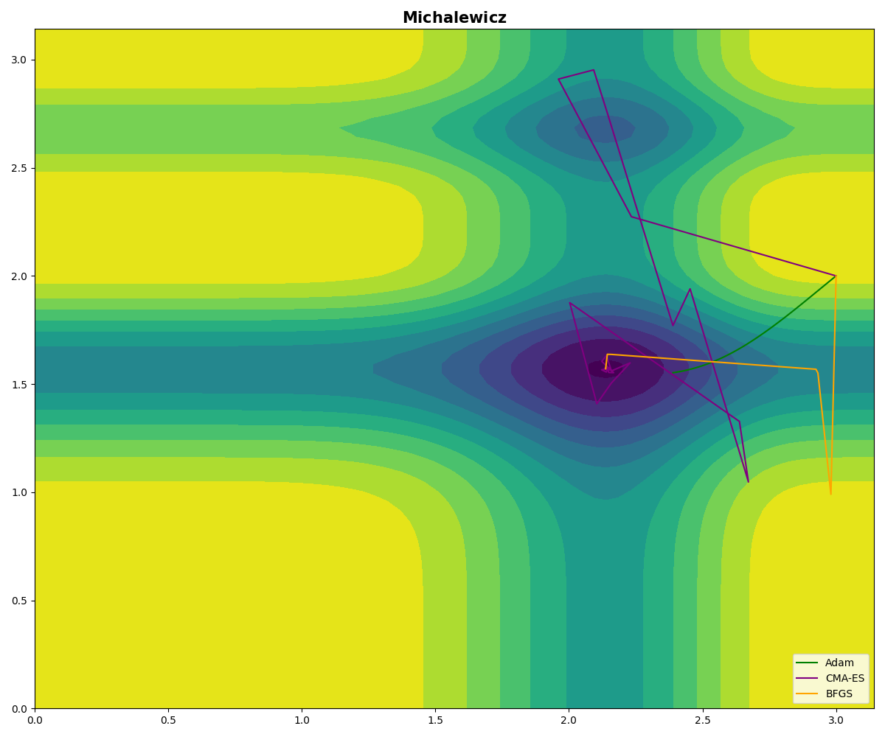

<h1 align="center">🧬 FastOpt</h1>

## Global Optimization with Streamlit

This project demonstrates various global optimization techniques allows users to visualize optimization paths for different functions and optimizers.

---
<h3 align="center">
    🎈 Try it out here: <a href="https://fastopt-xbvxc26r3a-de.a.run.app/">FastOpt 🎈 </a>
</h3>

---

    

## Features

- Multiple optimization functions: Ackley, Rastrigin, Rosenbrock, Fletcher, Michalewicz.
- Multiple optimizers: SGD, Adam, CMA-ES, LRA-CMA, BFGS, L-BFGS-B.
- Interactive visualizations with Streamlit.

    
    

